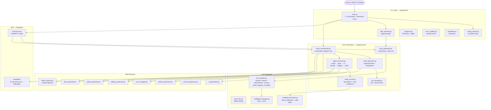
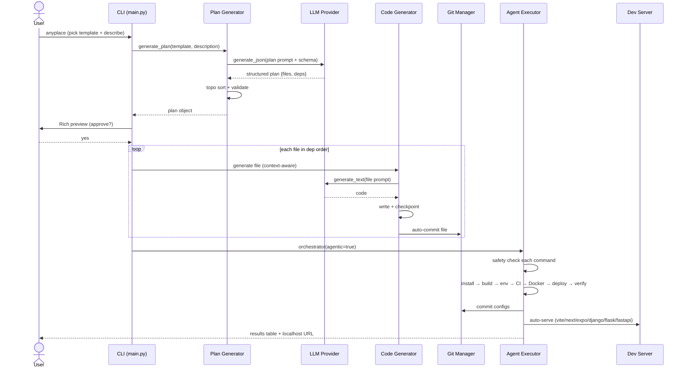
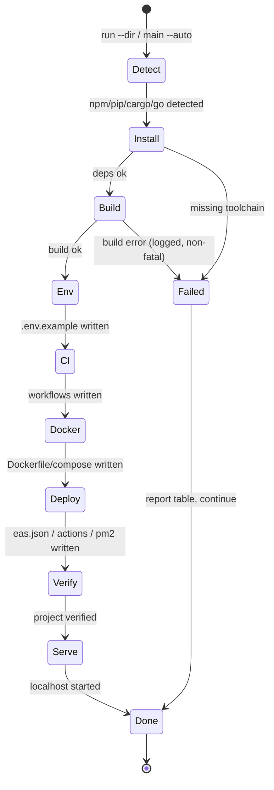

# AnywhereCode
### Code Anywhere, Anytime — Your AI Coding Partner in Your Pocket

> **For people whose main computer is a phone.** Generate, build, deploy, and learn full-stack projects entirely from Termux on Android — no laptop, no toolchain setup, no experience required.

[](https://python.org)
[](https://termux.dev)
[](#)
[](LICENSE)
[](#testing)

**Built by [RudraO2](https://github.com/RudraO2)** — designed phone-first, works everywhere.

Just type `anyplace` and describe what you want. AnywhereCode plans it, shows you the plan, generates the code, installs dependencies, builds it, sets up CI/Docker/deploy, commits to git, and even starts the dev server — autonomously.

```bash
curl -sL https://raw.githubusercontent.com/RudraO2/Classic-Snake-Made-using-Qwen-/main/install.sh | bash
anyplace
```

---

## Table of Contents

- [Why AnywhereCode?](#why-anywhercode)
- [Features](#features)
- [Quick Start](#quick-start)
- [Installation](#installation)
- [Usage](#usage)
- [Commands Reference](#commands-reference)
- [Project Templates](#project-templates)
- [How It Works](#how-it-works)
- [Architecture](#architecture)
- [Agentic Pipeline](#agentic-pipeline)
- [LLM Providers](#llm-providers)
- [Safety Guardrails](#safety-guardrails)
- [MCP Server](#mcp-server)
- [Project Structure](#project-structure)
- [Testing](#testing)
- [Configuration](#configuration)
- [Roadmap](#roadmap)
- [Contributing](#contributing)
- [Author](#author)
- [License](#license)

---

## Why AnywhereCode?

You *can* run other AI coding CLIs in Termux. But:

1. **Their interface assumes 80+ columns and a hardware keyboard.** AnywhereCode is built for a 40-column phone screen and a thumb.
2. **They assume you already have a toolchain and know what `npm run build` means.** AnywhereCode detects your project type, runs install/build/serve for you, and explains every step.

No approval processes. No manual setup hell. Just describe your idea → approve the plan → get a working, committed, built project.

---

## Features

- 🎯 **AI-Powered Planning** — See every file, dependency, and architecture note *before* a single line is generated. Approve or retry.
- ⚡ **Fully Agentic Execution** — After approval: generate → git commit per file → install → build → env → CI → Docker → deploy → verify → serve. No manual `npm install` / `npm run build` ever.
- 📱 **Mobile-First / Termux Ready** — Auto-detects Termux, uses safe paths (`~/Downloads` on phone, `~/.anyplace/projects` on desktop), pure-Python deps (no Rust toolchain needed).
- 🔌 **Multi-Provider LLM** — Claude, Gemini, OpenRouter, or any OpenAI-compatible custom endpoint. Direct `requests` calls, no heavy SDKs.
- 🛡️ **Safety Guardrails** — Every shell command is checked before execution. Human-accept (default, Y/n per step) or `--auto` mode.
- 🌐 **Auto-Serve** — After build, starts the right dev server automatically (Vite, Next.js, Express, Expo, Django, Flask, FastAPI).
- 🧱 **5 Production Templates** — React Vite, Expo React Native, Node.js API, Next.js Fullstack, FastAPI. Boilerplate only — you own the UI.
- 🔧 **DevOps Built-In** — `ci`, `docker`, `env`, `deploy` generators (GitHub Actions, GitLab, Bitbucket, CircleCI, multi-stage Docker + Postgres/Redis).
- 🎓 **Learn While Building** — `guide` (LEARNING.md + QUICKSTART.md), `docs` (CONTRIBUTING/CHANGELOG/API_DOCS), `explain <file>`.
- 🤖 **Claude Integration** — `commit` (AI commit messages), auto-injected `.claude/settings.json` + commands, full MCP server.
- 📦 **One-Command Install** — `curl | bash` installer for Termux/Linux: Python, git, Node, repo, `anyplace` on PATH.

---

## Quick Start

```bash
# 1. Install (Termux / Linux)
curl -sL https://raw.githubusercontent.com/RudraO2/Classic-Snake-Made-using-Qwen-/main/install.sh | bash
source ~/.bashrc   # Termux only, if 'anyplace' not found

# 2. Configure your AI provider (pick ONE)
anyplace configure

# 3. Create something
anyplace
# → pick template → describe project → approve plan → watch it build

# 4. Fully automatic mode (no confirmations)
anyplace main --auto

# 5. Run pipeline on an existing project
anyplace run --dir ./my-app --auto
```

---

## Installation

### Option A — One-command (recommended for phones)

```bash
curl -sL https://raw.githubusercontent.com/RudraO2/Classic-Snake-Made-using-Qwen-/main/install.sh | bash
```

This installs Python + git + Node.js (Termux via `pkg`), clones to `~/.anyplace/app`, installs `requests click pyyaml rich`, creates the `anyplace` wrapper in `~/.local/bin`, and offers to run `anyplace configure`.

### Option B — Manual (desktop / dev)

```bash
git clone https://github.com/RudraO2/Classic-Snake-Made-using-Qwen-.git
cd Classic-Snake-Made-using-Qwen-/AnywhereCode
pip install -e .
anyplace info
```

Requirements: Python 3.8+, git. Optional for MCP: `pip install "mcp>=1.0.0"`.

| Environment | Projects dir | Config dir |
|---|---|---|
| Desktop / Linux | `~/.anyplace/projects/` | `~/.config/anyplace/` |
| Termux / Android | `~/storage/downloads/` or `~/Downloads/` | `~/.config/anyplace/` |

Auto-detected — no manual setup.

---

## Usage

### Interactive flow (beginner-friendly)

```
anyplace
  1. Create a new project      → template → description → AI plan → approve → agentic build
  2. Continue existing project → pick project → commit / build / deploy / ci / docker / env / guide / docs / explain
```

### Direct commands

```bash
anyplace configure          # setup wizard for API keys
anyplace templates          # list templates
anyplace test-providers     # verify LLM connectivity
anyplace info               # platform + config status
anyplace commit --all       # AI commit message + commit
anyplace build --dir ./app  # detect type + build
anyplace run --dir ./app --auto --skip-deploy
```

---

## Commands Reference

All commands via `anyplace --help`. 17 commands:

| Command | What it does |
|---|---|
| `main [--auto]` | Interactive creation (default entry). `--auto` skips per-step confirmations. |
| `configure` | Wizard: provider → key → model → save. |
| `templates` | List all templates with stack + description. |
| `info` | Platform (Termux?), Python, config status, project dir. |
| `reset` | Wipe all saved configuration. |
| `test-providers` | Ping each configured provider (auth / latency). |
| `commit [--all] [--dry-run] [--dir]` | LLM conventional-commit message from staged diff. |
| `build [--install] [--dir]` | Detect Expo/Vite/Node/Python/Django/Rust/Go/Next.js → install + build with streamed output. |
| `deploy [--target eas\|github\|auto] [--dir]` | Generate `eas.json`, GitHub Actions, or PM2 `ecosystem.config.js`. |
| `ci [--platform github\|gitlab\|bitbucket\|circle]` | Full CI/CD configs adapted to project type. |
| `docker [--type dockerfile\|compose\|all]` | Multi-stage Dockerfile + `docker-compose.yml` (Postgres + Redis for backends) + `.dockerignore`. |
| `env [--validate]` | Generate curated `.env.example` or validate existing `.env` (missing/extra/ok). |
| `guide [--dir]` | Show LEARNING.md — curated docs, tutorials, tips, next steps per template (no LLM needed). |
| `docs [--type contributing\|changelog\|api\|all]` | Generate CONTRIBUTING.md, CHANGELOG.md, API_DOCS.md (LLM scans source, falls back to export listing). |
| `explain <file> [--dir]` | LLM-powered explanation of any file. |
| `run --dir PATH [--auto] [--skip-deploy]` | Full agentic pipeline on existing code: install → build → env → CI → Docker → deploy → verify + results table. |
| `serve` | Start MCP server for Claude integration. |

---

## Project Templates

Templates are **starting structure only** — never UI constraints.

| Template id | Stack | Good for |
|---|---|---|
| `web-react-vite` | React + Vite | SPA, portfolio, dashboard, landing page |
| `mobile-expo-rn` | React Native + Expo | Cross-platform mobile app |
| `backend-nodejs` | Node.js + Express | REST API, backend service |
| `fullstack-nextjs` | Next.js + Prisma + PostgreSQL | Full-stack web app with DB |
| `backend-python-fastapi` | FastAPI + SQLAlchemy + Alembic + Pydantic v2 | Python API, ML backend |

Add your own: create `anyplace/templates/{name}/` + `structure.json`.

---

## How It Works

1. **Pick** a template (or let AI suggest one).
2. **Describe** your project in one paragraph.
3. **AI plans** — structured plan: files, dependencies (topologically sorted), tech stack, architecture notes.
4. **You approve** — beautiful Rich preview grouped by type (config/source/test/doc) with generation order.
5. **Code generates sequentially** — dependency order, checkpoint per file, cleanup on failure, git auto-commit per file.
6. **Agentic pipeline takes over** — install, build, env, CI, Docker, deploy, verify, auto-commit configs, auto-serve on localhost.
7. **Learn** — QUICKSTART.md, LEARNING.md, CONTRIBUTING.md, CHANGELOG.md auto-generated in every project.

JSON failures, Gemini quirks, and rate limits degrade gracefully (tolerant extractor + retries) instead of crashing on your phone.

---

## Architecture

### System overview



### Generation sequence (plan → running app)



### Agentic pipeline state machine



---

## Agentic Pipeline

Replaces the old "Next steps: manually run ..." with autonomous execution (`anyplace/core/agent_executor.py`):

```
install → build → env → CI → Docker → deploy → verify → serve
```

- **Type detection:** Vite, Next.js, Expo, Express/Fastify, Django, Flask, FastAPI, Rust, Go.
- **Resilient:** each step is safe/no-raise — failures are reported, don't block the pipeline, and are committed to git history.
- **Live feedback:** Rich results table per step.
- **Modes:** human-accept default (`Y/n` per step) vs `--auto` (no prompts).

Auto-serve mapping:

| Project | Server command |
|---|---|
| React/Vite | `npx vite --host 0.0.0.0 --port 3000` |
| Next.js | `npx next dev -p 3000` |
| Express/Node | `npm run dev` or `npm start` |
| Expo | `npx expo start` |
| Django | `python3 manage.py runserver 0.0.0.0:8000` |
| Flask | `python3 -m flask run --host=0.0.0.0` |
| FastAPI | `python3 -m uvicorn main:app --host 0.0.0.0 --port 8000` |

---

## LLM Providers

Pick one. All via direct `requests` HTTP (no `litellm` — it needs Rust on Termux/aarch64).

| Provider | Key format | Get key | Notes |
|---|---|---|---|
| Claude (Anthropic) | `sk-ant-...` | https://console.anthropic.com | Best code quality. `POST api.anthropic.com/v1/messages` |
| Gemini (Google) | `AIza...` | https://aistudio.google.com/apikey | Free tier. Needs Generative Language API enabled. Uses `system_instruction` + `responseSchema` enforcement. |
| OpenRouter | `sk-or-...` | https://openrouter.ai/keys | 100+ models via OpenAI-compat endpoint. |
| Custom | your key + base_url | your server | Any OpenAI-compatible `/chat/completions`. Self-hosted LLMs work. |

```yaml
# ~/.config/anyplace/config.yaml
providers:
  claude:
    api_key: sk-ant-...
    model: claude-3-5-sonnet
  gemini:
    api_key: AIza...
    model: gemini-2.0-flash
  openrouter:
    api_key: sk-or-...
    model: anthropic/claude-3.5-sonnet
  custom:
    api_key: your-key
    base_url: https://custom-api.example.com
    model: your-model-id
```

Test with `anyplace test-providers`. No key? Use `test_e2e.py` with the built-in mock provider.

---

## Safety Guardrails

Checked **before** every shell execution in `agent_executor.py`:

- ❌ Blocked: `rm -rf`, `rm --force`, `chmod 777`, `chmod -R`, `sudo`, `su`, `killall`, `shutdown`, `reboot`, `git push --force`, `git reset --hard`, `curl | bash`, `eval`, `exec`, fork bombs, disk overwrites (`> /dev/sda` etc.)
- ✅ Allowed: `npm install`, `pip install`, `npm run build`, `git add/commit`, dev-server commands, etc.

Malformed commands fail closed (no `TypeError` crash). Logs go to `.logs/` for debugging, never raw stack traces to the user.

---

## MCP Server

For Claude integration:

```bash
anyplace serve
```

Tools (`FastMCP("AnywhereCode")`):

| Tool | Args | Returns |
|---|---|---|
| `list_templates` | — | templates + stacks |
| `generate_plan` | `template_name, project_name, description` | structured plan dict |
| `generate_project` | `template_name, project_name, description, output_dir` | fully agentic project |
| `setup_project` | `project_dir, skip_deploy` | pipeline result on existing dir |
| `install_dependencies` | `project_dir` | install log |
| `build_project` | `project_dir` | build log |

---

## Project Structure

```
AnywhereCode/
├── anyplace/
│   ├── cli/
│   │   ├── main.py            # 17 commands, interactive menu, run/main --auto
│   │   ├── config_wizard.py   # provider setup
│   │   ├── plan_preview.py    # approval gate UI
│   │   ├── progress.py        # Rich bars/tables
│   │   ├── templates.py       # discovery
│   │   └── error_handler.py   # friendly errors
│   ├── core/
│   │   ├── agent_executor.py  # autonomous pipeline + safety + accept modes
│   │   ├── build_orchestrator.py
│   │   ├── plan_generator.py  # AI planning + topo sort + PLAN_RESPONSE_SCHEMA
│   │   ├── code_generator.py  # sequential + checkpoints
│   │   ├── build_runner.py    # type detect + auto_install/auto_build + serve
│   │   ├── git_manager.py
│   │   ├── llm_provider.py    # direct HTTP, no litellm
│   │   ├── mock_llm.py
│   │   ├── ci_generator.py / docker_generator.py / env_manager.py
│   │   ├── deploy_generator.py / guide_generator.py / doc_generator.py
│   │   ├── commit_generator.py / hooks_injector.py
│   ├── config/
│   │   ├── api_manager.py
│   │   └── environment.py     # Termux detection + safe paths
│   ├── mcp/server.py
│   └── templates/{web-react-vite,mobile-expo-rn,backend-nodejs,fullstack-nextjs,backend-python-fastapi}/
├── test_e2e.py / test_json_fix.py
├── requirements.txt           # requests, click, pyyaml, rich (+ mcp optional)
├── setup.py                   # console_scripts: anyplace
└── README.md / CLAUDE.md
install.sh                     # one-command Termux/Linux installer
```

---

## Testing

```bash
cd AnywhereCode
python3 test_e2e.py      # 9/9 end-to-end (mock LLM, no key/network needed)
python3 test_json_fix.py # JSON extraction robustness
```

Covers: plan generation, approval preview, sequential generation (5+ files), git init/commit, commit-gen, build detection, hooks injection, deploy config, full orchestrator.

---

## Configuration

- `anyplace configure` — interactive wizard (recommended).
- `anyplace info` — show current config + platform.
- `anyplace reset` — wipe config.
- Manual: edit `~/.config/anyplace/config.yaml` (see [LLM Providers](#llm-providers)).

---

## Roadmap

- [ ] Phone-screen TUI polish (narrow-width layouts, thumb-friendly menus)
- [ ] Cloud APK builds from phone (EAS) + installable PWA output
- [ ] Keyless / free-tier onboarding path
- [ ] More templates (Django, Flutter, Go API)
- [ ] `anyplace doctor` — Termux health checks with exact fix commands
- [ ] CI status badges + live device test matrix

Have an idea? Open an issue — all design discussions are welcome.

---

## Contributing

1. Fork → branch → commit → PR.
2. Python 3.8+, clean typed code, docstrings, comprehensive error handling.
3. Add/extend `test_e2e.py` for new features.
4. Update this README + `CLAUDE.md` context if you change CLI or pipeline behavior.

```bash
pip install -e ".[mcp]"  # with MCP dev deps
python3 test_e2e.py
```

---

## Author

**RudraO2** — creator, designer, and maintainer of AnywhereCode.

- GitHub: https://github.com/RudraO2
- Project: https://github.com/RudraO2/Classic-Snake-Made-using-Qwen- (AnywhereCode lives in `/AnywhereCode`)

If AnywhereCode helped you build something on your phone, please ⭐ star the repo — it helps more mobile builders find it.

---

## License

MIT — see [LICENSE](LICENSE). Free for personal and commercial use. Build anywhere. 🚀
